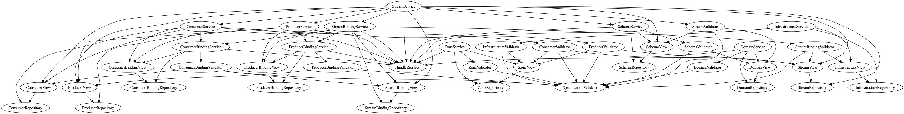

# Architecture of the `core` module

## Layers
The `core` module compreses the following layers:
 
* Services
* Handlers
* Views
* Validators

To avoid cyclical depedancies and seapration of concerns, the layers are structured like so.

### Services
Integration point for other modules of the control plane API. The layer where access control
is applied and business logic located. Services may call handlers, validators, other services
(mutations only) and views (read only).

### Handlers
Hook layer where requests can be intercepted.

### Views
Components that allow unauthorised reads of entity repositories. Typically they do not interact
with any layers other than the repository. These are normally called by services, validators,
and rarely components outside of the core. The results they should exit an externally facing
port without mediation by a security layer (usually a Service).

### Validators
Validate requests. Validators should typically only call other validators or views. They should
not call services.

## Dependencies
This graph describes the main dependencies between components in the various layers of the core
module.

[Generated using dot](doc/deps.dot)

