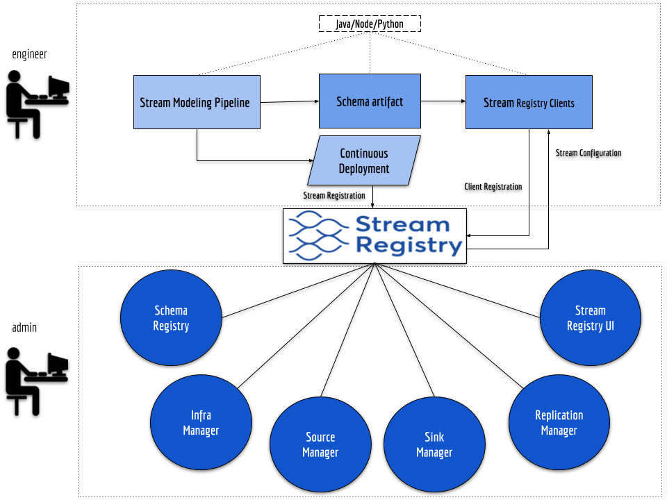
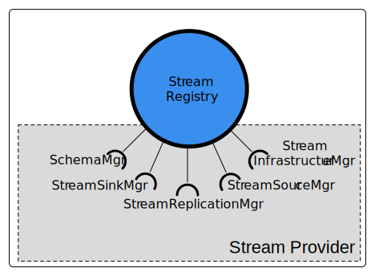
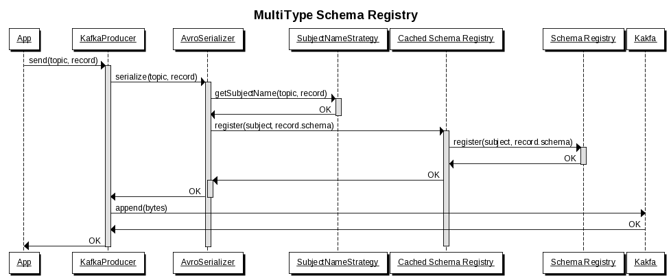
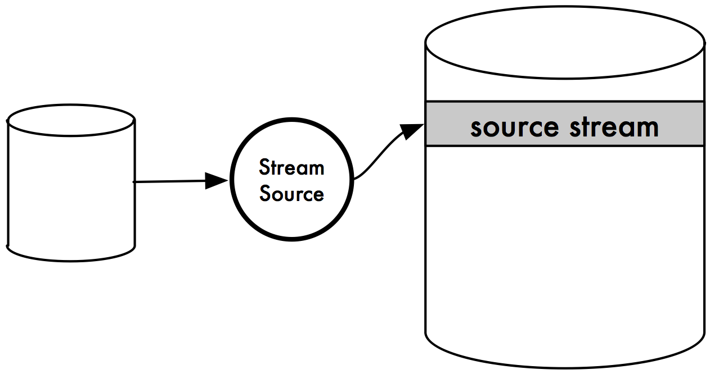

# Stream Registry Architecture
<center>

</center>

The stream registry is primarily concerned with the centralized management of
the lifecycle of streams in the enterprise. It serves as a central
system of record (SOR) declarative source of truth (SOT) for stream metadata.

<center></center>

## Stream Provider Plugin Architecture
<center></center>

**Stream Providers**

Stream Providers are plugins that work within the stream registry that
implement the various bits and pieces of the stream registry that are both
platform-specific and enterprise-specific.

For example, the stream-registry will likely be open sourced with a
`generic-kafka-stream-provider` to work with the Apache Kafka stream platform
in a generic manner.  Chances are, that Acme Inc, might want to expand on this
generic functionality and add Acme-specific ConfigMaps and functionality.
They can do so by extending `generic-kafka-stream-provider` to come up with
an `acme-kafka-stream-provider`.

These stream providers are typically jar files that have classes that
implement the various _manager_ interfaces depicted in the figure above.

**Manager Interfaces**

The following table describes a high level function of each of the
_manager interfaces_.

| manager                       | function                                                                                                               |
|-------------------------------|------------------------------------------------------------------------------------------------------------------------|
| Stream Infrastructure Manager | Serves as an abstraction for stream bindings,<BR/> the actual realization of streams in the underlying infrastructure. |
| Schema Manager                | Serves as an abstraction for the underlying schema registry.                                                           |
| Stream Source Manager         | Serves as an abstraction for managing stream sources.                                                                  |
| Stream Sink Manager           | Serves as an abstraction for managing stream sinks.                                                                    |
| Stream Replication Manager    | Serves as an abstraction for managing stream replication between clusters.                                             |

The following sections will describe in detail what is features are supported by each of these interfaces as
well as describing the interface requirements themselves.

## Stream Infrastructure Manager

**Stream Infrastructure Manager** manages the declaration of namespaces and clusters
as well as the management of stream lifecycles.

### Namespaces

**The Root Stream Registry**

Like DNS, the Stream Registry is hierarchical and has a 'root' namespace, `"/"`.
The 'root' namespace is the **default namespace** of a vanilla stream registry.

```SQL
> SHOW NAMESPACE
"/"
```

??? Note
    **SQL 'DDL' syntax:**<BR/>
    This documentation uses 'DDL'-esque syntax to communicate _command concepts_. The actual API and/or
    command line tools may differ (the command line tools may use a stream config language and there will likely
    be a UI tool released that helps users interact with the stream registry directly).
    ```SQL
    > CREATE STREAM "widgets_v0" ...;
    ```

Let say that we leave this instance of the stream registry alone and deploy it such
that its API is at `https://<root-registry-api-uri>`

An administrator can configure a second stream registry instance to have a different namespace:

```SQL
> SHOW NAMESPACE
"/"
> DECLARE DEFAULT NAMESPACE "us-reg1-xyz"
> DECLARE PARENT REGISTRY "https://<root-registry-api-uri>";
> SHOW NAMESPACE
"/us-reg1-xyz"
```

The above might be used to declare a "region" in AWS us-reg1-xyz for the given VPC.
This could be used for when there are "multiple" regions for a given single company.

To declare a second "region", an administrator might perform the following command
on yet another, third, stream registry instance:

```SQL
> SHOW NAMESPACE
"/"
> DECLARE DEFAULT NAMESPACE "us-aus1-dc01"
> DECLARE PARENT REGISTRY "https://<root-registry-api-uri>";
> SHOW NAMESPACE
"/us-aus1-dc01"
```

This can continue to create a "layer" of namespaces to be used/configured however suits the administrator.
In the example above, the namespace is being used for regions.  However it could be used for other hierarchies.
Lets walk through an example.

!!! Info
    It is recommended that a stream registry be available in the namespace that it serves.
    So in the example so far, we would have a stream registry in each region it was deployed.
    The "root" stream registry could be deployed in either region, or possibly a third region that represents
    the "root" namespace.  In practice only "leaf" namespaces serve streams.  "Non-leaf" namespaces serve as
    aggregators for child namespaces.

**Namespace example**

Lets say that Acme, Inc. company has 2 cloud providers and a company paas for 2
data centers:

<center>

| Cloud | Region/VPC        |
|:-----:|-------------------|
| aws   | us-reg1-xyz |
| aws   | us-reg2-xyz |
| gcp   | us-reg1-foo |
| gcp   | us-reg2-foo |
| mpaas | us-aus1-dc01      |
| mpaas | us-aus2-dc02      |

</center>

The administrator sets up 3 stream registries for the "cloud provider" namespace layer.
```SQL
-- deployed on AWS stream registry with uri: https://<aws-sr-uri>
> DECLARE DEFAULT NAMESPACE "aws";
> DECLARE PARENT REGISTRY "https://<root-registry-api-uri>";
> SHOW NAMESPACE;
"/aws"

-- deployed on GCP stream registry with uri: https://<gcp-sr-uri>
> DECLARE DEFAULT NAMESPACE "gcp";
> DECLARE PARENT REGISTRY "https://<root-registry-api-uri>";
> SHOW NAMESPACE;
"/gcp"

-- deployed on mpaas stream registry with uri: https://<mpaas-sr-uri>
> DECLARE DEFAULT NAMESPACE "mpaas";
> DECLARE PARENT REGISTRY "https://<root-registry-api-uri>";
> SHOW NAMESPACE;
"/mpaas"
```

Then lets say that the administrator already had 2 stream registries running with the following namespaces pointing
at the root namespace `/`.

<center>

| Namespace         |
|-------------------|
| us-reg1-xyz |
| us-aus1-dc01      |

</center>

The parent registry of the `us-reg1-xyz` namespace is updated to point to `/aws` and the parent registry
of the `us-aus1-dc01` namespace is updated to point to `/mpaas`.

```SQL
-- on us-reg1-xyz
> DECLARE PARENT REGISTRY "https://<aws-sr-uri>";
> SHOW NAMESPACE;
"/aws/us-reg1-xyz"


-- on us-aus1-dc01
> DECLARE PARENT REGISTRY "https://<mpaas-sr-uri>";
> SHOW NAMESPACE;
"/mpaas/us-aus1-dc01"
```

In this manner, arbitrary topologies can be created.  An enterprise can start with one region, one cluster,
and later, easily expand to multiple regions, multiple data centers, multiple clouds, and eventually multiple
companies.  This becomes extremely useful, especially during mergers for fast sharing of data, allowing
teams to adapt to the streams and eventually merge appropriately over time.

### Clusters

The following declares 3 clusters in one stream registry (for the `/us-aus1-dc01` namespace):
```SQL
> SHOW NAMESPACE;
"/us-aus1-dc01"
> DECLARE CLUSTER "cluster001";
> DECLARE CLUSTER "cluster002";
> DECLARE CLUSTER "cluster003";
```

The following declares 1 cluster in another stream registry (for the `/us-reg1-xyz` namespace):
```SQL
-- Performed on us-reg1-xyz
> SHOW NAMESPACE;
"/us-reg1-xyz"
> DECLARE CLUSTER "cluster004";
```

Now with our namespaces and clusters declared, we can create our streams.

!!! Info
    The difference between `DECLARE` and `CREATE`, is that `DECLARE` may or may not have side effects
    depending on the infrastructure manager.  `CREATE` is intended to explicitly have side-effects (eg. creation
    of the underlying resource).

### Streams

The following creates, updates, or deletes a stream in the local namespace of the stream registry.

```SQL
> CREATE STREAM "widgets_v0" WITH CONFIG {
    "acme.kafka": {
      "owner": "bob@acme.com",
      "team": "widgets-team",
      "costcenter": "341D",
    },
    "apache.kafka": {
      "partitions": 10,
      "replication": 4,
      "min_isr": 2,
      "compacted": "true",
      "compression": "snappy",
      "unclean.leader.election.enable": "false",
      "key.serde": "string",
      "value.serde": "specific",
    }
  } WITH PRODUCER CONFIG {
     "apache.kafka": {
       "acks": "all",
       "retries": 0,
       "enable.idempotence": "false",
     }
  } WITH CONSUMER CONFIG {
     "apache.kafka": {
       "acks": "all",
       "retries": 0,
       "enable.idempotence": "false",
     }
  }
```

This command registers the stream `"widgets_v0"` with the stream registry.
At this point, there is no schema, no stream bindings, or other stateful
operations associated with the stream.  Only the metadata supplied
will be registered with `"widgets_v0"`.

??? note
    This stream registration happens _locally_ (in the local namespace) only!!!
    Other stream registrations in other stream registries (whether connected or not)
    _**are allowed**_. This is to allow maximum flexibility and also reduce contention
    locking and consistency across namespaces for stream registration.

    The tradeoff is, that during inter-namespace replication, however, the stream must be explicitly
    created in the remote stream-registry before replication will be allowed to occur.
    If the stream is already created in the remote stream-registry, the latest schema of the source
    stream must be compatible with the schema in the remote stream to accept replication.

**Config Maps:**

This command also introduces the notion of a _config map_.  A
**config map** is a hashmap of config key-value pairs specific to a
given stream-platform or enterprise.

In the example above, there are two config maps: `acme.kafka` and
`apache.kafka`.  `acme.kafka` is a _company specific_ config map that provides
ownership and cost information.  `apache.kafka` is a stream platform
specific config map.

Specifics for each config map vary from stream provider to stream provider.
Some config maps can be defaulted, others may be required. Consult the
documentation of your specific stream provider for details.

**Producer/Consumer Config Maps:**

The stream also defines producer/consumer config map defaults. These defaults
are provided to stream-bindings, producer and consumer requests once the
stream is bound to a particular cluster.  Stream Binding config maps take
precedence over stream-level config maps.  By providing definitions at the
stream level, commonConfig is simplified and only "override" commonConfig
need be specified at the binding level.

Now that we have our streams created with the necessary metadata,
we are ready to "_bind the streams_" to a given cluster,
so that they can start receiving and sending data.

### Bindings

Stream bindings realize the streams in the underlying stream platforms.

The following command binds the `"widgets_v0"` stream to the `cluster001` cluster:

```SQL
> CREATE BINDING "widgets_v0" TO CLUSTER "cluster001";
```

You can create multiple bindings per namespace and override any applicable stream level
config maps.

```SQL
> CREATE BINDING "widgets_v0" TO CLUSTER "cluster002" WITH CONFIG {
... -- override any cluster specific stream configmaps here
} WITH PRODUCER CONFIG {
... -- override any cluster specific producer configmaps here
} WITH CONSUMER CONFIG {
... -- override any cluster specific consumer configmaps here
}
```

**Default Stream Bindings:**

The first binding for a cluster is declared as the **default**.  This means, that when a producer or consumer
asks for that stream without specifying a cluster, the stream registry will respond with the first binding
created for that stream.

```SQL
> DESCRIBE BINDINGS "widgets_v0"
| stream     | cluster    | default |
|------------+------------+---------|
| widgets_v0 | cluster001 | yes     |
| widgets_v0 | cluster002 | no      |
```


### Stream Infrastructure Manager Interface

Stream providers should implement the following interface to manage stream-platform and
company specific configmaps.

```java
/**
 * This interface is implemented by a stream provider to provide
 * stream platform and/or company specific requirements related to
 * clusters, streams and stream bindings.
 *
 * TODO - Future operations may deal with cluster creation
 * instead of just cluster validation
 */
public interface StreamInfrastructureManager {
  /**
   * Validates the configMaps provided for the given cluster are valid.
   */
  void validateCluster(String clusterName,
                       Map<String, ConfigMap> configMap)
                       throws InfrastructureException;

  /**
   * Validates the configMaps provided for the given stream are valid.
   */
  void validateStream(String streamName,
                      Map<String, ConfigMap> configMap)
                      throws InfrastructureException;

  /**
   * Creates the stream binding in the underlying stream platform.
   * ConfigMaps guide the creation of the stream.
   *
   * @param streamName the name of the stream to create.
   * @param clusterName the name of the cluster that the stream
   *        should be creted on.
   * @param configMap the map of configmaps -- applicable overrides apply.
   * @throws InfrastructureException This is thrown when
   *         the operation could not complete.
   */
  void createStreamBinding(String streamName,
                           String clusterName,
                           Map<String, ConfigMap> configMap)
                           throws InfrastructureException;

  /**
   * Updates the stream in the given stream platform
   * with the supplied configmaps.
   *
   * @param streamName the name of the stream to update.
   * @param clusterName the name of the cluster whose metadata should be updated.
   * @param configMap the map of configmaps -- applicable overrides apply.
   * @throws InfrastructureException This is thrown when
   *         the operation could not complete.
   */
  void updateStreamBinding(String streamName,
                           String clusterName,
                           Map<String, ConfigMap> configMap)
                           throws InfrastructureException;

  /**
   * Deletes the stream in the given stream platform.
   *
   * @param streamName the name of the stream to delete
   * @param clusterName the name of the cluster where the stream should be deleted.
   * @throws InfrastructureException This is thrown when
   *         the operation could not complete.
   */
  void deleteStreamBinding(String streamName, String clusterName)
                           throws InfrastructureException;
}
```

## Schema Registry

The schema registry is responsible for storing versioned, sequenced set of schemas for a given stream.
It is typically responsible for providing various compatibility levels and formats.  The schemas can be
provided by id, and are typically useful for "at-rest" storage (such as Hive).  The actual details of the
schema registry is deferred to the underlying schema registry.

**Partition Key Schema**

Each key of a stream message (event) has a schema.  By default this is a string.
```SQL
> REGISTER KEY SCHEMA (
    "string"
  ) ON STREAM "widgets_v0";

| Subject        | Version |  Id |
|----------------+---------+-----|
| widgets_v0-key |       1 | 121 |

```

**Single Type Schema per Stream**

Each stream needs at least one type per stream.
```SQL
> REGISTER TYPE SCHEMA "Widget" (
    FILE widget.avsc
  ) ON STREAM "widgets_v0";

| Subject           | Version |  Id |
|-------------------+---------+-----|
| widgets_v0-Widget |       3 | 347 |
```

Streams can also support multiple types per streams.
```SQL
> REGISTER TYPE SCHEMA "WidgetNameUpdated" (
    FILE widget_name_updated.avsc
  ) ON STREAM "widget_command_events_v0";
| Subject                                    | Version |  Id |
|--------------------------------------------+---------+-----|
| widget_command_events_v0-WidgetNameUpdated |       3 | 347 |

> REGISTER TYPE SCHEMA "WidgetColorUpdated" (
    FILE widget_color_updated.avsc
  ) ON STREAM "widget_command_events_v0";
| Subject                                     | Version |  Id |
|---------------------------------------------+---------+-----|
| widget_command_events_v0-WidgetColorUpdated |       1 | 213 |
```

Like the confluent platform, the determination of a stream _subject_ is provided by a SubjectNameStrategy.
See [Martin Kleppmann's post on the subject for the mechanics][multi-type] of how Confluent does this.

In practice bundled serializers will do this at runtime.

[multi-type]: https://www.confluent.io/blog/put-several-event-types-kafka-topic/



For design time, the stream registry should provide delegation mechanisms to allow a developer to register the schema
for a particular stream during the CI/CD phase for a given target environment.

### Schema Manager Interface

Schema Registries must implement the Schema Manager interface.

!!! info
    This interface was modeled upon [Confluent's Schema Registry](https://docs.confluent.io/current/schema-registry/docs/api.html).

```java
@Data
/**
 * POJO for representing a pointer to a given schema.
 */
public class SchemaReference {
  public SchemaReference(String subject, long version, long id);
}

public enum CompatibilityLevel {
  BACKWARD_TRANSITIVE, FORWARD_TRANSITIVE,  FULL_TRANSITIVE
}

/**
 * This interface is implemented by a stream provider to provide
 * organization specific requirement to the underlying schema registry.
 */
public interface SchemaManager {
  /**
   * Register a new schema under the specified subject. If successfully
   * registered, this returns the unique identifier of this schema in
   * the registry. The returned identifier should be used to retrieve
   * this schema from the schemas resource and is different from the
   * schema’s version which is associated with the subject. If the
   * same schema is registered under a different subject, the same
   * identifier will be returned. However, the version of the schema
   * may be different under different subjects.
   *
   * A schema should be compatible with the previously registered schema
   * or schemas (if there are any) as per the configured compatibility level.
   * @param subject Subject under which the schema will be registered
   * @param schema The Avro schema string
   * @return a SchemaReference for the registered schema
   */
  public SchemaReference registerSchema(String subject, String schema)
                                        throws SchemaManagerException;

  /**
   * Register a new schema under the specified subject. If successfully
   * registered, this returns the unique identifier of this schema in
   * the registry. The returned identifier should be used to retrieve
   * this schema from the schemas resource and is different from the
   * schema’s version which is associated with the subject. If the
   * same schema is registered under a different subject, the same
   * identifier will be returned. However, the version of the schema
   * may be different under different subjects.
   *
   * A schema should be compatible with the previously registered schema
   * or schemas (if there are any) as per the configured compatibility level.
   * @param subject subject under which the schema is checked to be registered
   * @return a SchemaReference if the requested schema was registered
   */
  public SchemaReference isSchemaRegistered(String subject, String schema)
                                            throws SchemaManagerException;

  /**
   * Get the avro schema for the specified version of this subject.
   * The unescaped schema only is returned.
   * @param subject name of the subject
   * @param version Version of the schema to be returned.
   * @return Returns the avro schema string (unescaped)
   */
  public String getSchema(String subject, int version)
                          throws SchemaManagerException;

  /**
   * Get the schema string identified by the input ID.
   * @param id the globally unique identifier of the schema
   * @return Schema string identified by ID (escaped).
   */
  public String getSchema(int id)
                          throws SchemaManagerException;

  /**
   * Deletes a specific version of the schema registered under this
   * subject. This only deletes the version and the schema ID remains
   * intact making it still possible to decode data using the schema ID.
   * This API is recommended to be used only in development environments
   * or under extreme circumstances where-in, its required to delete a
   * previously registered schema for compatibility purposes or re-register
   * previously registered schema.
   */
  public void deleteSchema(String subject, int versionId) throws SchemaException;

  /**
   * The subjects resource provides a list of all registered subjects
   * in your Schema Registry. A subject refers to the name under which
   * the schema is registered. If you are using Schema Registry for Kafka,
   * then a subject refers to either a “<topic>-key” or “<topic>-value”
   * depending on whether you are registering the key schema for that
   * topic or the value schema.
   * @return a list of subjects
   */
  public List<String> getSubjects() throws SchemaException;

  /**
   * Get a list of versions registered under the specified subject.
   * @param subject - the name of the subject
   * @return A list of integers specifying the versions of the schema
   *         under this subject.
   */
  public List<Integer> getSubjectVersions(String subject) throws SchemaException;

  /**
   * Deletes the specified subject and its associated compatibility
   * level if registered. It is recommended to use this API only when
   * a topic needs to be recycled or in development environment.
   * @param subject -  the subject to delete
   * @return A list of versions that were deleted.
   */
  public List<Integer> deleteSubject(String subject) throws SchemaException;

  /**
   * Update global compatibility level.
   * @param level the compatibility level to set at the global level
   */
  public void setGlobalCompatibility(CompatibilityLevel level)
                                     throws SchemaException;

  /**
   * Get global compatibility level.
   * @return the global compatibility level.
   */
  public CompatibilityLevel getGlobalCompatibility();

  /**
   * Update compatibility level for the specified subject
   * @param subject name of the subject
   * @param level the compatibility level to set at the global level
   */
  public void setCompatibility(String subject,
                               CompatibilityLevel level)
                               throws Schema Exception;

  /**
   * Get compatibility level for a subject.
   * @return the compatibility level for a subject.
   */
  public CompatibilityLevel getCompatibility(String subject);

  /**
   * Test input schema against a particular version of a
   * subject’s schema for compatibility.
   */
  public boolean checkCompatibility(String subject, int version,
                                    String schema)
                                    throws SchemaException;
}
```

## Stream Sources

A _Stream Source_ is any source of streams.  It can be another streaming platform,
a traditional data store, an API, devices, an online spreadsheet, a mainframe --
basically its any data source and a monitor of changing _events_ on that data source.

<center></center>

First there needs to be a way of knowing which source types are supported by the given **Stream Source Manager**.

```SQL
> SHOW SOURCE TYPES FOR CLUSTER "cluster001";
|-----------------|
| SOURCE TYPE     |
|-----------------|
| s3              |
| cassandra       |
| jdbc            |
| kinesis         |
| postgres        |
| mariadb         |
|-----------------|
```

Once the developer knows which source types are available, they can declare a stream source.

```SQL
> CREATE STREAM SOURCE "widgets_sql_source"
  WITH TYPE "sqlserver-ct" WITH CONFIG {
    "sqlserver-source" : {
      ... -- sql server configs --
    },
    "acme.sqlserver-source" : {
      ... -- company specific configs
    }
  } ON CLUSTER "cluster001";

> DESCRIBE STREAM SOURCE "widgets_sql_source";
|--------------------+-------------+---------------+---------|
| STREAM SOURCE      | CLUSTER     | TYPE          | STATUS  |
|--------------------+-------------+---------------+---------|
| widgets_sql_source | cluster001  | sqlserver-ct  | PENDING |
|--------------------+-------------+---------------+---------|
```

By convention, the stream source name matches the name
of the source stream in the underlying platform. This means
that a source stream _binding_ must exist on the target cluster
in order for the stream source creation operation to succeed.

In the above example the name of the stream source is "widgets_sql_source",
and the name of the source stream is also "widgets_sql_source".

When the source is ready its state will change correspondingly.
```SQL
> DESCRIBE STREAM SOURCE "widgets_sql_source";
|--------------------+-------------+---------------+---------|
| STREAM SOURCE      | CLUSTER     | TYPE          | STATUS  |
|--------------------+-------------+---------------+---------|
| widgets_sql_source | cluster001  | sqlserver-ct  | ONLINE  |
|--------------------+-------------+---------------+---------|
```


Developers can also update and delete stream sources.

```SQL
> UPDATE STREAM SOURCE "widgets_sql_source" WITH CONFIG {
    "sqlserver-source" : {
      ... -- sql server configs --
    },
    "acme.sqlserver-source" : {
      ... -- company specific configs
    }
};
> DELETE STREAM SOURCE "widgets_sql_source";
```

### Stream Source Manager Interface

```java
/**
 * The DTO that represents the StreamSource object.
 */
@Data
public void StreamSource {
  public StreamSource(String sourceName, String cluster, String type, String status, Map<String, ConfigMap> configMap);
}
/**
 * This interface is implemented by a stream provider to provide
 * stream platform and/or company specific requirements related to
 * stream sources.
 */
public interface StreamSourceManager {
  /**
   * Returns a list of supported source types.
   * The actual list will vary by stream provider.
   * @param cluster the target cluster for provisioned source types
   * @return the available source types for the given cluster
   * @throws StreamSourceException This is thrown when
   *         the operation could not complete.
   */
  List<String> getSourceTypes(String cluster) throws StreamSourceException;

  /**
   * Creates the stream source in the underlying stream platform.
   * ConfigMaps guide the creation of the stream.
   *
   * @param sourceName the name of the source to create.
   * @param type the type of the source to create. Must be one of the supported types.
   * @param clusterName the name of the cluster that the stream
   *        should be created on.
   * @param configMap the map of configmaps.
   * @return the created stream source
   * @throws StreamSourceException This is thrown when
   *         the operation could not complete.
   */
  StreamSource createStreamSource(String sourceName, String type,
                                  String clusterName,
                                  Map<String, ConfigMap> configMap)
                                  throws StreamSourceException;

  /**
   * Retrieves a StreamSource from the underlying stream provider.
   * @param sourceName the name of the source to retrieve
   * @return the requested stream source
   * @throws StreamSourceException This is thrown when
   *         the operation could not complete.
   */
  StreamSource getStreamSource(String sourceName)
                               throws StreamSourceException;

  /**
   * Updates the stream source in the underlying stream provider
   * with the supplied config maps.
   *
   * @param sourceName the name of the stream source to update.
   * @param configMap the map of config maps -- applicable overrides apply.
   * @return the updated stream source
   * @throws StreamSourceException This is thrown when
   *         the operation could not complete.
   */
  StreamSource updateStreamSource(String sourceName,
                                  Map<String, ConfigMap> configMap)
                                  throws StreamSourceException;

  /**
   * Deletes the stream source in the given stream platform.
   *
   * @param sourceName the name of the stream source to delete
   * @return the deleted stream source
   * @throws StreamSourceException This is thrown when
   *         the operation could not complete.
   */
  StreamSource deleteStreamSource(String sourceName) throws StreamSourceException;
}
```

## Stream Sinks

A _Stream Sink_ is a sink of any one stream.  It can be another streaming platform,
a traditional data store, an API, devices, an online spreadsheet, a mainframe --
basically its any data sink. A _Stream Sink_ is essentially an export
of a single _sink stream_ to that data store.

<center></center>

```SQL
> SHOW SINK TYPES FOR CLUSTER "cluster001";
|-------------|
| SINK TYPE   |
|-------------|
| s3          |
| cassandra   |
| jdbc        |
| kinesis     |
| postgres    |
| mariadb     |
|-------------|
```

First there needs to be a way of knowing which sink types are supported by the given **Stream Sink Manager**.
Once the developer knows which sink types are available, they can declare a stream sink.

```SQL
> CREATE STREAM SINK "widgets_s3_sink"
  WITH TYPE "s3" WITH CONFIG {
    "s3-sink" : {
      ... -- s3 configs --
    },
    "acme.s3-sink" : {
      ... -- company specific configs for s3 --
    }
  } ON CLUSTER "cluster001";

> DESCRIBE STREAM SINK "sink";
|-----------------+------------+------+---------|
| STREAM SINK     | CLUSTER    | TYPE | STATUS  |
|-----------------+------------+------+---------|
| widgets_s3_sink | cluster001 | s3   | PENDING |
|-----------------+------------+------+---------|
```

By convention, the stream sink name matches the name
of the sink stream in the underlying platform. This means
that a sink stream _binding_ must exist on the target cluster
in order for the stream sink creation operation to succeed.

In the above example the name of the stream sink is "widgets_s3_sink",
and the name of the sink stream is also "widgets_s3_sink".

When the sink is ready its state will change correspondingly.
```SQL
> DESCRIBE STREAM SINK "widgets_s3_sink";
|-----------------+------------+------+---------|
| STREAM SINK     | CLUSTER    | TYPE | STATUS  |
|-----------------+------------+------+---------|
| widgets_s3_sink | cluster001 | s3   | ONLINE  |
|-----------------+------------+------+---------|
```

Developers can also update and delete stream sinks.

```SQL
> UPDATE STREAM SINK "widgets_s3_sink" WITH CONFIG {
    "s3-sink" : {
      ... -- s3 configs --
    },
    "acme.s3-sink" : {
      ... -- company specific configs for s3 --
    }
};
> DELETE STREAM SINK "widgets_s3_sink";
```

### Stream Sink Manager Interface

```java
/**
 * The DTO that represents the StreamSink object.
 */
@Data
public void StreamSink {
  public StreamSink(String sinkName, String cluster, String type, String status, Map<String, ConfigMap> configMap);
}

/**
 * This interface is implemented by a stream provider to provide
 * stream platform and/or company specific requirements related to
 * stream sinks.
 */
public interface StreamSinkManager {
  /**
   * Returns a list of supported sink types.
   * The actual list will vary by stream provider.
   * @param cluster the target cluster for provisioned sink types
   * @return the available sink types for the given cluster
   * @throws StreamSinkException This is thrown when
   *         the operation could not complete.
   */
  List<String> getSinkTypes(String cluster) throws StreamSinkException;

  /**
   * Creates the stream sink in the underlying stream platform.
   * ConfigMaps guide the creation of the stream.
   *
   * @param sinkName the name of the sink to create.
   * @param type the type of the sink to create. Must be one of the supported types.
   * @param clusterName the name of the cluster that the stream
   *        should be created on.
   * @param configMap the map of config maps.
   * @return the created stream sink
   * @throws StreamSinkException This is thrown when
   *         the operation could not complete.
   */
  StreamSink createStreamSink(String sinkName, String type,
                              String clusterName,
                              Map<String, ConfigMap> configMap)
                              throws StreamSinkException;

  /**
   * Retrieves a StreamSink from the underlying stream provider.
   * @param sinkName the name of the sink to retrieve
   * @return the requested stream sink
   * @throws StreamSinkException This is thrown when
   *         the operation could not complete.
   */
  StreamSink getStreamSink(String sinkName)
                           throws StreamSinkException;

  /**
   * Updates the stream sink in the underlying stream provider
   * with the supplied configmaps.
   *
   * @param sinkName the name of the stream sink to update.
   * @param configMap the map of configmaps -- applicable overrides apply.
   * @return the updated stream sink
   * @throws StreamSinkException This is thrown when
   *         the operation could not complete.
   */
  StreamSink updateStreamSink(String sinkName,
                              Map<String, ConfigMap> configMap)
                              throws StreamSinkException;

  /**
   * Deletes the stream sink in the given stream platform.
   *
   * @param sinkName the name of the stream sink to delete
   * @return the deleted stream sink
   * @throws StreamSinkException This is thrown when
   *         the operation could not complete.
   */
  StreamSink deleteStreamSink(String sinkName) throws StreamSinkException;
}
```

## Stream Replication

!!! info
    A quick segue back to namespaces.  A namespace can be any hierarchy
    specified by current namespace and the parent namespace, recursively
    all the way up to the root namespace, "/".  So, for a given stream-registry
    the current fully qualified namespace may be `"/foo/bar/baz"`.

    When a stream binding occurs for a given cluster, implicitly the cluster is appended
    to the end of the namespace path:
    `"/foo/bar/baz/cluster001"`

    So if "widgets_v0" is bounded to "cluster001", then the fully qualified name of the stream is:
    `"/foo/bar/baz/cluster001/widgets_v0"`

**Intra-NameSpace Replication**

Intra-NameSpace replication is when replication occurs between clusters in the same namespace.

```SQL
> REPLICATE BINDING "cluster001/widgets_v0"
  TO CLUSTER "cluster002";
```

This operation replicates the stream from `cluster001/widgets_v0` (in the current namespace,
as specified by no leading slash, implying "current namespace") to `"cluster002"`.

!!! info
    The important thing to note is that the underlying stream on cluster002 (if any for widgets_v0),
    still exists.  There will be an additional stream binding, on cluster002 specifically named
    `cluster001/widgets_v0` to signify this topic originates from `cluster001/widgets_v0` and not
    from cluster002.

The developer can also query the state of the replication.

```SQL
> SHOW REPLICATIONS ON CLUSTER "cluster002";
|------------+-----------------------+---------|
| CLUSTER    | TOPIC                 | STATUS  |
|------------+-----------------------+---------|
| cluster002 | cluster001/widgets_v0 | PENDING |
|------------+-----------------------+---------|
```

When the replication is online, its status will update.

```SQL
> SHOW REPLICATIONS ON CLUSTER "cluster002";
|------------+-----------------------+---------|
| CLUSTER    | TOPIC                 | STATUS  |
|------------+-----------------------+---------|
| cluster002 | cluster001/widgets_v0 | ONLINE  |
|------------+-----------------------+---------|
```
**Inter-NameSpace Replication**

Cross namespace replication is also possible.  This is the only
interaction that requires cross namespace communication / coordination.  
Lets say there is a company called "acme group" and it has two
different brands, "brickco" and "rocketco".  Lets also assume that
the local `cluster002` is in the current namespace
`/rocketco/aus1/us-somewhere-001`. The remote cluster `cluster034` is in
`/brickco/aws/us-reg1-xyz`. Consider the following command:

```SQL
> REPLICATE BINDING "cluster034/widgets_v0" FROM NAMESPACE "/brickco/aws/us-reg1-xyz"
  TO CLUSTER "cluster002";
```

??? note
    The developer is able to discover the remote namespace, cluster and stream via
    *stream discovery*. This is a achieved via a different *stream registry ui* service
    that aggregates known stream registry meta data across all known namespaces.
    By aggregating the metadata and indexing it, it packages all streams to
    allow developers to discover and monitor all data in flight.

??? note
    Also, this assumes that the "widgets_v0" stream already exists in the local namespace.
    (Presumably it already exists in the remote namespace and cluster).
    If it does not, the replication will fail.  Future versions may also check that the remote
    schemas are all available in the current stream registry, if not then there is a risk of
    consumer error when a local consumer starts to consume from "widgets_v0" stream.

Like before, we can monitor replication status.
```SQL
> SHOW REPLICATIONS ON CLUSTER "cluster002";
|------------+-------------------------------------------------------+---------|
| CLUSTER    | TOPIC                                                 | STATUS  |
|------------+-------------------------------------------------------+---------|
| cluster002 | cluster001/widgets_v0                                 | ONLINE  |
| cluster002 | /brickco/aws/us-reg1-xyz/cluster034/widgets_v0 | PENDING |
|------------+-------------------------------------------------------+---------|
```

When the replication is online, its status will update.
```SQL
> SHOW REPLICATIONS ON CLUSTER "cluster002";
|------------+-------------------------------------------------------+---------|
| CLUSTER    | TOPIC                                                 | STATUS  |
|------------+-------------------------------------------------------+---------|
| cluster002 | cluster001/widgets_v0                                 | ONLINE  |
| cluster002 | /brickco/aws/us-reg1-xyz/cluster034/widgets_v0 | ONLINE  |
|------------+-------------------------------------------------------+---------|
```

### Stream Replication Manager Interface

```java
/** The DTO that represents a stream replication. */
@Data
public void StreamReplication {
  public StreamReplication(String cluster, String topic, String status);
}

/**
 * This interface is implemented by a stream provider to provide
 * stream platform and/or company specific requirements related to
 * stream replication.
 */
public interface StreamReplicationManager {
  /**
   * Returns a list of existing replications in the current namespace.
   * @return the list of existing replications.
   * @throws StreamReplicationException This is thrown when
   *         the operation could not complete.
   */
  List<StreamReplication> listReplications() throws StreamReplicationException;

  /**
   * Returns a list of existing replications for the given cluster.
   * @param cluster the target cluster to retrieve replications
   * @return the list of existing replications for the given cluster
   * @throws StreamReplicationException This is thrown when
   *         the operation could not complete.
   */
  List<StreamReplication> listReplications(String cluster) throws StreamReplicationException;

  /**
   * Creates the stream replication in the underlying stream platform.
   *
   * @param cluster the cluster that the replication should be created on.
   * @param remoteCluster the remote cluster to replicate
   * @param remoteStream the remote stream to replicate
   * @param remoteNamespace the name of the remote namespace
   *        (same as local if local)
   * @return the created stream sink
   * @throws StreamReplicationException This is thrown when
   *         the operation could not complete.
   */
  StreamReplication createReplication(String cluster,
                                      String remoteCluster,
                                      String remoteStream,
                                      String remoteNamespace)
                                      throws StreamReplicationException;

  /**
   * Retrieves a stream replication from the underlying stream provider.
   * @param cluster the cluster the replication is replicating to
   * @param remoteCluster the remote cluster being replicated
   * @param remoteStream the remote stream being replicated
   * @param remoteNamespace the name of the remote namespace
   *        (same as local if local)
   * @return the requested stream replication
   * @throws StreamReplicationException nThis is thrown when
   *         the operation could not complete.
   */
  StreamReplication getReplication(String cluster,
                                   String remoteCluster,
                                   String remoteStream,
                                   String remoteNamespace)
                                   throws StreamReplicationException;

  /**
   * Deletes the stream replication in the given stream platform.
   *
   * @param cluster the cluster the replication is replicating to
   * @param remoteCluster the remote cluster being replicated
   * @param remoteStream the remote stream being replicated
   * @param remoteNamespace the name of the remote namespace
   * @return the deleted stream replication
   * @throws StreamReplicationException This is thrown when
   *         the operation could not complete.
   */
  StreamReplication deleteReplication(String cluster,
                                      String remoteCluster,
                                      String remoteStream,
                                      String remoteNamespace)
                                      throws StreamReplicationException;
}
```

## Stream Relocation

<center></center>

This command relocates a stream from `cluster001` to `cluster002`:

```SQL
> CREATE STREAM RELOCATION "widgets_v0"
  FROM CLUSTER "cluster001"
  TO CLUSTER "cluster002";
```

Once created you can check on the status:

```SQL
> DESCRIBE STREAM RELOCATION "widgets_v0" FROM CLUSTER "cluster001";
|------------+------------+------------+-----------------|
| STREAM     | FROM       | TO         | STATUS          |
|------------+------------+------------+-----------------|
| widgets_v0 | cluster001 | cluster002 | BINDING_PENDING |
|------------+------------+------------+-----------------|
```

The states vary from:

- REPLICATION_PENDING
- REPLICATION_COMPLETE
- CONSUMERS_MIGRATING
- CONSUMERS_COMPLETE
- PRODUCERS_MIGRATING
- PRODUCERS_COMPLETE
- REPLICATION_DELETE_PENDING
- REPLICATION_DELETED
- BINDING_DELETE_PENDING
- BINDING_DELETED

```SQL
> DESCRIBE STREAM RELOCATION "widgets_v0" FROM CLUSTER "cluster001";
|------------+------------+------------+-----------------|
| STREAM     | FROM       | TO         | STATUS          |
|------------+------------+------------+-----------------|
| widgets_v0 | cluster001 | cluster002 | BINDING_DELETED |
|------------+------------+------------+-----------------|
```

### Stream Relocation Manager Interface

```java
/** The DTO that represents a stream relocation. */
@Data
public void StreamRelocation {
  public StreamRelocation(String stream, String sourceCluster, String targetCluster, String status);
}

/**
 * This interface is implemented by a stream provider to provide
 * stream platform and/or company specific requirements related to
 * stream relocation.
 */
public interface StreamRelocationManager {
  /**
   * Returns a list of existing relocations.
   * @param sourceCluster the source cluster to list the replication
   * @return the list of existing replications
   * @throws StreamRelocationException This is thrown when
   *         the operation could not complete.
   */
  List<StreamRelocation> getRelocations(String sourceCluster)
                                        throws StreamRelocationException;

  /**
   * Returns the requested stream relocation.
   * @param stream the stream being relocated
   * @param sourceCluster the source cluster of the stream
   * @return the requested stream relocation
   * @throws StreamRelocationException This is thrown when
   *         the operation could not complete.
   */
  StreamRelocation getRelocation(String stream,
                                 String sourceCluster)
                                 throws StreamRelocationException;

  /**
   * Creates the stream relocation.
   *
   * @param stream the name of the stream to relocate
   * @param sourceCluster the source cluster of the stream
   * @param targetCluster the source cluster of the stream
   * @return the created stream relocation
   * @throws StreamRelocationException This is thrown when
   *         the operation could not complete.
   */
  StreamRelocation createRelocation(String stream,
                                    String sourceCluster,
                                    String targetCluster)
                                    throws StreamRelocationException;

  /**
   * Deletes the stream relocation.
   *
   * @param stream the stream being relocated to be deleted
   * @param sourceCluster the source cluster of the relocation
   * @return the deleted stream relocation
   * @throws StreamRelocationException This is thrown when
   *         the operation could not complete.
   */
  StreamRelocation deleteRelocation(String stream,
                                    String sourceCluster)
                                    throws StreamRelocationException;
}
```
